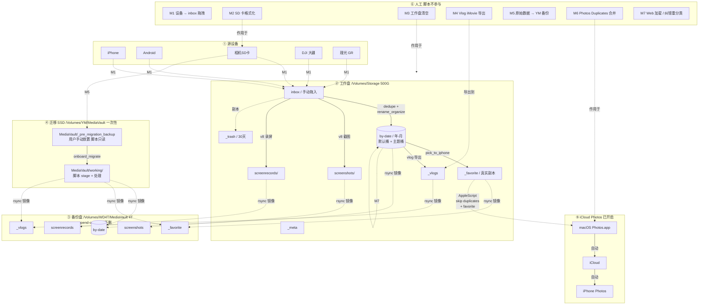

# 个人照片视频整理方案（PicVault）

## Summary

三盘架构 + 严格路径沙箱：工作盘 `/Volumes/Storage`（500G 机械）日常处理；备份盘 `/Volumes/WD4T/MediaVault/`（4T 机械）只接收 rsync 镜像；首次启动用 SSD `/Volumes/YM/MediaVault` 做迁移工作区。**脚本正式只读写这三个路径**；`/Users/ym/Downloads/pic-test` 仅用于自测。

流水线：手动导入到 inbox → dedupe（SHA-256）→ rename_organize（by-date + screenshots + screenrecords，v8 分类）→ rsync 到 WD4T。精选走 `_favorite/` 真实复制 + AppleScript（`skip checking duplicates yes` + 打 favorite）。AppleScript 中带主题 → 相册名=主题名；无主题 → 相册名固定 `"Picks"`。iCloud Photos 已开启，AppleScript 跑完后自动同步到 iPhone。Vlog 推荐 iMovie。**首次迁移用户自行在 `/Volumes/YM/MediaVault/_pre_migration_backup/` 放好原始数据**，脚本只负责 stage → 处理 → rsync 回 WD4T。SD 卡格式化和工作盘清空人工完成。

## 路径沙箱

| 路径 | 角色 |
|---|---|
| `/Volumes/Storage/` | 工作盘（500G 机械） |
| `/Volumes/WD4T/MediaVault/` | 备份库（4T 机械），外层其他内容不动 |
| `/Volumes/YM/MediaVault/` | 迁移 SSD，首次启动一次性 |

脚本启动校验正式路径都在白名单内；`/Users/ym/Downloads/pic-test` 仅用于自测。临时文件 `/tmp/PicVault-<pid>/`。

## 总体架构



### 区块编号索引

| 编号 | 区块 | 角色 |
|---|---|---|
| ① | 源设备 | 5 种设备：iPhone / Android / SD卡 / DJI / 理光 GR |
| ② | 工作盘 `/Volumes/Storage` | 500G 机械；日常写入和处理 |
| ③ | 备份盘 `/Volumes/WD4T/MediaVault` | 4T 机械；rsync 镜像，只增不删 |
| ④ | 迁移 SSD `/Volumes/YM/MediaVault` | 一次性；首次启动迁移用 |
| ⑤ | iCloud Photos | 已开启；macOS Photos → iCloud → iPhone 自动同步 |
| ⑥ | 人工 | 脚本不参与的 7 个动作 |

### 三条主路径

| 路径 | 走向 | 触发场景 |
|---|---|---|
| **A** 日常流水线 | ① → ② → ③ | 每次导入新素材时 |
| **B** 首次启动 | ① → ④ → ③ | 一次性，处理 4T 上的存量数据 |
| **C** 精选到 iPhone | ② → ⑤ | Web 加星后导出精选到 iPhone |

### 人工动作代号

| 代号 | 动作 | 何时执行 |
|---|---|---|
| M1 | 设备 → inbox 手动拖拽 | 每次导入素材 |
| M2 | SD 卡格式化 | 归档完成 + 备份验证后 |
| M3 | 工作盘清空 | sync_to_backup 校验通过后 |
| M4 | Vlog iMovie 导出 | 剪辑完成后 |
| M5 | 原始数据 → YM 备份 | 首次启动前一次性 |
| M6 | Photos Duplicates 合并 | 每次 AppleScript 跑完后 |
| M7 | Web 加星 / 选精选 / 截图录屏纠错 | 整理时浏览 + 打星 |

### 箭头类型说明

- **实线箭头** `A --> B`：脚本自动执行
- **虚线箭头** `A -. B .-> C`：人工动作（M1-M7）或脚本 vs 人工的边界
- **带标签箭头**：标注脚本动作名（`dedupe + rename`、`rsync 镜像`、`AppleScript`）
- **`-->` 无标签箭头**：节点内部自动流转（如 inbox → by-date）

## 设备 → inbox：手动拖拽

用户用 Finder 把设备里的照片/视频拖到 `/Volumes/Storage/inbox/`，子目录结构任意：

```
inbox/
├── IMG_4521.jpg                    ← 单文件
├── DCIM/100CANON/IMG_4521.CR2      ← 整 SD 卡 DCIM
├── iPhone-七月备份/                ← 用户命名
└── 海南/DCIM/...                   ← 按主题分文件夹
```

脚本递归遍历 inbox。

## 源识别：EXIF + `.source` 旁路 + `--source` CLI

识别顺序：

1. **EXIF `Make`** → 白名单映射
2. **`.source` 旁路文件**：与目标文件并列的纯文本文件，内容是 source 名
3. **`--source NAME` CLI 参数**
4. 都无 → 文件名**省略 source 段**

| EXIF Make | → source |
|---|---|
| Apple | `iphone` |
| Samsung / Xiaomi / Huawei / OPPO / vivo / OnePlus / Google | 各自品牌名 |
| Canon | `canon`（多台用 `--source` 或 `.source` 区分）|
| NIKON CORPORATION | `nikon` |
| SONY | `sony` |
| FUJIFILM | `fuji` |
| RICOH IMAGING | `ricoh-gr` |
| DJI | `dji`（CLI 区分 nano/action/pocket/osmo）|
| GoPro | `gopro` |

实现：照片用 PIL 读 EXIF tag `0x010F`；视频用 `ffprobe` 读 `format_tags` 的 make/model。

## 关于手机星标：v1 不支持，需要重打

iPhone Favorites、Android 相册星标都在系统相册数据库，不在照片文件里。v1 默认：手机原星标不会自动带过来，需在 `web_browse.py` 里重新打星。

## iCloud Photos：用户前置条件

需要用户在系统设置里**已经开启** iCloud Photos（Apple ID → iCloud → Photos → 开启）。AppleScript 跑完后自动同步到 iPhone，无需 USB 或手动操作。

## 目录结构

### `/Volumes/Storage/`（工作盘）

```
/Volumes/Storage/
├── inbox/
├── by-date/
│   └── 2026/
│       ├── 2026-07/                # 默认桶
│       │   ├── photos/
│       │   └── videos/
│       └── 2026-07_海南/           # 旁挂桶
│           ├── photos/
│           └── videos/
├── screenshots/                    # 截图（图）根目录
│   ├── screenshot_20260715_183022_iphone_a3f2.png
│   └── ...
├── screenrecords/                  # 录屏（视频）根目录
│   ├── screenrecorder_20260715_143000_a1b2.mov
│   └── ...
├── docs/                           # 文档照片（手动移入，不自动分类）
│   ├── doc_20260715_183022_iphone_a3f2.jpg
│   └── ...
├── things/                         # 物品照片/视频（手动移入，不自动分类）
│   ├── things_20260715_183022_iphone_a3f2.jpg
│   └── ...
├── _favorite/
│   ├── 2026-07_海南/               # 带主题：来自主题桶 → 同名子目录
│   ├── 2026-08/                    # 无主题：按 bucket 建子目录，Photos 相簿名仍为 Picks
│   ├── 2026-08_夏令营/
│   └── ...
├── _vlogs/
├── _trash/
└── _meta/
    ├── events.yaml
    ├── stars/
    ├── edl/
    ├── checksums/
    ├── thumbs/
    ├── scripts/                    # pick_to_iphone.py 生成的 AppleScript
    └── logs/
```

### `/Volumes/WD4T/MediaVault/`（备份库）

```
/Volumes/WD4T/
├── (其他)                          # 脚本不动
└── MediaVault/
    ├── by-date/                    # 镜像自 Storage 或 SSD
    ├── screenshots/                # 镜像：截图
    ├── screenrecords/              # 镜像：录屏
    ├── docs/                       # 镜像：文档
    ├── things/                     # 镜像：物品
    ├── _favorite/
    └── _vlogs/
```

### `/Volumes/YM/MediaVault/`（迁移 SSD）

```
/Volumes/YM/MediaVault/
├── _pre_migration_backup/          # 用户手动放置；脚本不动
└── working/                        # 脚本创建和处理
    ├── inbox/
    ├── by-date/
    ├── screenshots/
    ├── screenrecords/
    ├── docs/
    ├── things/
    ├── _favorite/
    ├── _vlogs/
    ├── _trash/
    └── _meta/
```

## 命名规范

**`YYYYMMDD_HHMMSS_<source?>_<4位hash前4>.<ext>`**

- 日期：EXIF `DateTimeOriginal` → 视频 `creation_time` → mtime
- `<source?>`：能识别就写；不能识别**省略**（不写 `unknown`）
- `<4位hash>` = SHA-256 前 4 位十六进制

源白名单：`iphone` `samsung` `xiaomi` `huawei` `oppo` `vivo` `oneplus` `google` `canon` `canon-a/b` `nikon` `nikon-a` `sony` `sony-a` `fuji` `fuji-a` `ricoh-gr` `ricoh-gr2` `dji` `dji-nano/action/pocket/osmo` `gopro`

Live Photo（同目录同名 HEIC/JPG + MOV）成对进 `by-date/.../photos/`，共用 stem `<date>_<source>_live_<hash>`（无 source 则为 `<date>_live_<hash>`）；Web 画廊只展示静图。单边仍按普通规则。截图/录屏分类见下文「截图/录屏检测（v8）」。

## 截图/录屏检测（v8）

截图与录屏分两桶；相机文件名白名单与 maker 证据优先保真。

### 判定顺序

0. **`is_camera_filename`**（`IMG_` / `VID_` / `DJI_` / `GOPR` / …）→ **normal** → `by-date/`

**图片**（非视频）：
1. **Maker 证据**（EXIF Make，或归档文件名中的白名单 source，如 `screenshot_…_sony_…`）→ `by-date/`
2. 文件名含 `screenshot` → `screenshots/`
3. **无 EXIF GPS** → `screenshots/`
4. 否则 → `by-date/`

**视频**：
1. 文件名含 `record`（子串，覆盖 Screen Recording / Screenrecorder 等）→ `screenrecords/`
2. **无 Make 或 无 GPS/location** → `screenrecords/`
3. 否则 → `by-date/`

> iOS `RPReplay_Final_*.mov` 不含 `record`，靠规则 2（无元数据）进 `screenrecords/`。
> 存量误归：`rename_organize.py --fix-maker-screenshots [--dry-run]` 将 `screenshots/` 中有 maker 证据的文件移回 `by-date/`。

### 命名与落盘

| 类型 | 目录 | 命名 |
|---|---|---|
| screenshot | `screenshots/` | `screenshot_<date>_<source?>_<hash>.ext` |
| recording | `screenrecords/` | `screenrecorder_<date>_<source?>_<hash>.ext` |
| docs（仅手动） | `docs/` | `doc_<date>_<source?>_<hash>.ext` |
| things（仅手动） | `things/` | `things_<date>_<source?>_<hash>.ext` |
| normal | `by-date/...` | `<date>_<source?>_<hash>.ext` |

### 命名示例（v8）

| 原始文件名 | 来源 | 走哪 |
|---|---|---|
| `Screenshot_2026-07-15_18-30-22.png` | Android 截图 | `screenshots/` |
| 无 GPS 但有 EXIF Make 的相机 JPG | 相机（关定位） | `by-date/photos/`（v8 maker）|
| 无 GPS 的微信/小红书 JPG（非相机名、无 Make） | 社交另存 | `screenshots/` |
| `Screen Recording 2026-07-15.mov` | macOS | `screenrecords/`（含 record）|
| `Screenrecorder_20260715.mp4` | Android | `screenrecords/` |
| `RPReplay_Final_1689496200.mov` | iOS 录屏 | `screenrecords/`（无 Make/GPS）|
| `wechat_video.mp4`（无元数据） | 微信 | `screenrecords/` |
| `VID_20240715_140012.mp4` | 相机名白名单 | `by-date/videos/` |
| `IMG_0001.HEIC`（有 Apple Make） | iPhone 拍照 | `by-date/photos/`（相机名）|
| `IMG_4521.CR2` | 佳能 | `by-date/photos/`（相机名）|

### 归档目标

```
/Volumes/Storage/
├── by-date/...
├── screenshots/                  ← 仅截图（图）
│   └── screenshot_20260715_xxx_iphone_a3f2.png
└── screenrecords/                ← 仅录屏（视频）
    ├── screenrecorder_20260715_xxx_<hash>.mov
    └── screenrecorder_20260716_xxx_<hash>.mp4
```

### `rename_organize.py` 核心逻辑

```
for each file in inbox:
  capture = classify_capture(...)   # screenshot | recording | normal
  dest, name = compute_dest(work, file, capture)
  # screenshot → screenshots/screenshot_...
  # recording  → screenrecords/screenrecorder_...
  # normal     → by-date/<year>/<month>[_theme]/photos|videos>/...
  shutil.move(file, dest)
```

Web 纠错复用同一套 `plan_destination` / `reclassify_paths`：
- **移至截图录屏**：按后缀图→screenshot、视频→recording（不重跑启发式）
- **移回普通分类**：force normal
- **移至文档**：force docs（手机拍的证件/票据等）
- **移至物品**：force things（物品照片/视频）
- 工具栏按当前页隐藏「已在目标」按钮（普通页无「移回普通」；截图/录屏页无「移至截图录屏」；文档页无「移至文档」；物品页无「移至物品」）

### Web 浏览

```
GET  /                    # 图库首页：文件夹总览（年月、截图、录屏、文档、物品、主题、回收站计数）
GET  /by-date             # 年月：按年份/月桶浏览普通照片和视频
GET  /y/<year>            # 年月下的年份入口
GET  /y/<year>/<month>    # 年月下的月桶 / 主题桶图库
GET  /screenshots           # 截图库
GET  /screenrecords         # 录屏库
GET  /docs                  # 文档库
GET  /things                # 物品库
POST /api/reclassify        # {action: to_screen|to_normal|to_docs|to_things, paths:[...]}
POST /api/star
```

加星：`_meta/stars/screenshots.json` / `screenrecords.json` / `docs.json` / `things.json` / `<月份桶>.json`；重分类时自动迁移星标路径。

### 精选到 iPhone

```bash
./scripts/pick_to_iphone.py --bucket screenshots
./scripts/pick_to_iphone.py --bucket screenrecords
```

### 误判与纠错

| 场景 | 行为 |
|---|---|
| 相机文件名白名单 | 强制 by-date |
| 无 GPS 社交图（无 Make） | screenshots/（符合 v8）|
| 元数据被剥的真照片（非相机名） | 可能进 screenshots/ → Web「移回普通分类」|
| 已归档存量 | 不会自动重扫；用 Web 勾选纠错 |

`--no-gps-rule` 在 v7 已废弃（激进规则默认始终开启）。

## 首次启动：SSD 迁移（用户准备数据，脚本处理）

### 步骤 0：用户手动放置原始数据

```bash
mkdir -p /Volumes/YM/MediaVault/_pre_migration_backup
cp -r /Volumes/WD4T/MediaVault/2024 /Volumes/YM/MediaVault/_pre_migration_backup/
cp -r /Volumes/WD4T/MediaVault/2025 /Volumes/YM/MediaVault/_pre_migration_backup/
# 或 rsync / 或 Finder 拖拽
```

**为什么用户做这一步**：用户最清楚要处理哪些数据、要不要排除某些文件、APFS clone 还是全量复制。

### 步骤 1：脚本 stage + init

```bash
./scripts/onboard_migrate.sh
# 默认行为：
#   - 验证 _pre_migration_backup 存在且非空
#   - 在 working 创建目录骨架
#   - 把 _pre_migration_backup 内容复制到 working/inbox/
#   - 完全不动 _pre_migration_backup/ 本身
```

可选子命令：
```bash
./scripts/onboard_migrate.sh --backup /Volumes/YM/MediaVault/_pre_migration_backup \
                            --work /Volumes/YM/MediaVault/working
./scripts/onboard_migrate.sh --dry-run
```

### 步骤 2：SSD 上跑流水线

```bash
./scripts/dedupe.py --work /Volumes/YM/MediaVault/working
./scripts/rename_organize.py --work /Volumes/YM/MediaVault/working
./scripts/add_theme.py --work /Volumes/YM/MediaVault/working --interactive
./scripts/rename_organize.py --work /Volumes/YM/MediaVault/working
```

### 步骤 3：rsync 回 WD4T

```bash
./scripts/sync_to_backup.sh \
  --work   /Volumes/YM/MediaVault/working \
  --backup /Volumes/WD4T/MediaVault
```

`--include` 显式白名单只镜像 `by-date/` `screenshots/` `screenrecords/` `docs/` `things/` `_favorite/` `_vlogs/`，**不动 WD4T 其他内容**。

### 步骤 4：校验

```bash
./scripts/sync_to_backup.sh --verify \
  --work   /Volumes/YM/MediaVault/working \
  --backup /Volumes/WD4T/MediaVault
```

### 步骤 5：人工收尾

- 验证 WD4T 上 `/MediaVault/by-date/` 等结果 OK
- 删 SSD 的 `working/`（结果已镜像）
- 保留 SSD 的 `_pre_migration_backup/` ≥30 天作为回滚保险

### 失败安全网

| 失败阶段 | 数据还在哪 | 恢复方式 |
|---|---|---|
| stage 失败 | SSD `_pre_migration_backup/` | 重跑 stage |
| 处理失败 | SSD `working/inbox/` + `_pre_migration_backup/` | 重跑 dedupe/rename |
| rsync 失败 | WD4T 原 + SSD working/ + `_pre_migration_backup/` | 重跑 sync |
| 全部完成 | WD4T + SSD 备份双份 | 删 working/ 即可 |

## 脚本清单

| 脚本 | 作用 |
|---|---|
| `init_storage.sh` | 在指定根目录创建顶层目录骨架（含 `screenshots/` `screenrecords/`） |
| `dedupe.py` | SHA-256 精确去重；源从 EXIF/`.source`/`--source` 三层识别；重复文件入 `_trash/` |
| `rename_organize.py` | 重命名 + 归档；v8：by-date / screenshots / screenrecords |
| `add_theme.py` | 交互式追加主题到 events.yaml |
| `onboard_migrate.sh` | 把 `_pre_migration_backup/` 内容 stage 到 `working/inbox/`；不动 `_pre_migration_backup/` 本身 |
| `sync_to_backup.sh` | rsync 工作盘 → 备份盘（白名单含 screenrecords；默认 append-only） |
| `web_browse.py` | 本地画廊 + 加星 + 双向重分类（`/api/reclassify`） |
| `pick_to_iphone.py` | 加星文件真实复制到 `_favorite/` + 生成 AppleScript |
| `make_vlog.py` | 可选：EDL JSON + ffmpeg 轻量 vlog |

每个脚本启动校验 `--work` `--backup` 在白名单内。

> 之前版本里的 `snapshot` 子命令已**移除**（用户自行在 SSD 上准备数据）。

## 精选导出：副本 + AppleScript + iCloud Photos

### AppleScript 用途

把 `_favorite/` 文件系统结构翻译成 macOS Photos 库语义：

| 文件系统侧 | Photos 侧 |
|---|---|
| `_favorite/2026-07_海南/` 文件夹 | 相簿 `"2026-07_海南"` |
| `_favorite/<bucket>/` 无主题月份文件夹 | 相簿 `"Picks"`（固定名，与 bucket 无关）|
| 文件本身 | Photos 媒体项 + `favorite=true`（⭐）|

四件事：
1. **建相簿** — 文件夹名 → 相簿名（带主题用主题名；无主题用 `Picks`）
2. **导入文件** — 文件夹内容 → 相簿媒体项
3. **去重** — `skip checking duplicates yes` 让 Photos 自带去重生效
4. **打星标** — 每个媒体项的 `favorite` 属性设为 `true`

### Step 1：Web UI 加星

`web_browse.py` 在桶页面点 ★ → 写入 `_meta/stars/<bucket>.json`

### Step 2：`pick_to_iphone.py`

```bash
$ ./scripts/pick_to_iphone.py --bucket 2026-07_海南

✓ 读取 _meta/stars/2026-07_海南.json：23 张
✓ 刷新 /Volumes/Storage/_favorite/2026-07_海南/
✓ 生成 _meta/scripts/favorite-2026-07_海南.scpt

下一步：
  osascript /Volumes/Storage/_meta/scripts/favorite-2026-07_海南.scpt

$ ./scripts/pick_to_iphone.py --bucket 2026-08

✓ 读取 _meta/stars/2026-08.json：12 张
✓ 刷新 /Volumes/Storage/_favorite/2026-08/
✓ 生成 _meta/scripts/favorite-2026-08.scpt
```

行为：
- 读 `_meta/stars/<bucket>.json`
- 每次先刷新 `_favorite/<bucket>/`，移除该 bucket 上次导出的旧文件
- `shutil.copy2()` 真实复制当前星标文件

### Step 3：AppleScript（带主题版）

`_meta/scripts/favorite-<theme>.scpt`：

```applescript
on run
    set bucketName to "2026-07_海南"
    set folderPath to "/Volumes/Storage/_favorite/2026-07_海南"
    set albumName to bucketName

    tell application "Photos"
        activate
        set importFolder to (POSIX file folderPath) as alias

        if not (exists album albumName) then
            make new album named albumName
        end if

        import {importFolder} into (album albumName) skip checking duplicates yes
        delay 5

        set theItems to media items of album albumName
        repeat with anItem in theItems
            set favorite of anItem to true
        end repeat
    end tell
end run
```

### Step 4：AppleScript（无主题版，固定 `"Picks"`）

`_meta/scripts/favorite-<month>.scpt`：

```applescript
on run
    set bucketName to "2026-08"
    set folderPath to "/Volumes/Storage/_favorite/2026-08"
    set albumName to "Picks"   -- 固定名，与 bucket 无关

    tell application "Photos"
        activate
        set importFolder to (POSIX file folderPath) as alias

        if not (exists album albumName) then
            make new album named albumName
        end if

        import {importFolder} into (album albumName) skip checking duplicates yes
        delay 5

        set theItems to media items of album albumName
        repeat with anItem in theItems
            set favorite of anItem to true
        end repeat
    end tell
end run
```

### Step 5：跑 AppleScript + Duplicates 合并

```bash
osascript /Volumes/Storage/_meta/scripts/favorite-2026-07_海南.scpt
osascript /Volumes/Storage/_meta/scripts/favorite-2026-08.scpt

# 跑完后打开 Photos.app → 左侧栏 Duplicates 相簿 → 逐组合并
```

### Step 6：iCloud Photos 后台自动同步

```
macOS Photos（新相簿 + 新媒体 + favorite=true）
       ↓ iCloud 后台上传
   iCloud
       ↓ iCloud 后台推送
iPhone Photos（同相簿 + ⭐ + 收藏相簿）
```

零步骤：iCloud 已开启，AppleScript 跑完后自动同步到 iPhone。

## 关于 iCloud 已存照片的重复

### AppleScript 的去重

`skip checking duplicates yes` 让 macOS Photos 在导入时自动跳过字节级相同的文件 + 视觉指纹近似的文件。

### 不能完全避免

- 同图不同元数据（编辑过的版本）→ 不会跳过
- 同图但裁剪/旋转不同 → 不会跳过
- Live Photo 单边（只有 HEIC 没有 MOV）→ 当作新项导入

### Duplicates 相簿兜底

macOS Ventura+ Photos.app 左侧栏有 "Duplicates" 相簿。AppleScript 跑完后用户人工过一遍、点 Merge 合并。这是**必要的人工步骤**。

## Web 浏览（web_browse.py）

Flask 单进程，依赖仅 Pillow + Flask + ffmpeg，监听 `:8765`。

- 路由：`/`（图库总览） `/by-date`（年月） `/y/<year>` `/y/<year>/<month>` `/screenshots` `/screenrecords` `/docs` `/things` `/starred` `/themes` `POST /api/star` `POST /api/reclassify` `/raw` `/thumb`
- 回收站仅在首页显示 `_trash/` 计数；当前不提供 `/trash` 浏览或恢复页面
- 排序默认 `capture`；缩略图懒加载
- 画廊支持勾选 +「移至截图录屏 / 移回普通分类 / 移至文档 / 移至物品」
- 仅监听 LAN；HEIC 缩略图走 macOS `sips`
- 启动时校验 `--work` 在白名单内，并确保 `screenrecords/` 存在

## 数据安全分析

### 关键承诺

1. **路径沙箱**：脚本只读写 `/Volumes/Storage` `/Volumes/WD4T/MediaVault` `/Volumes/YM/MediaVault`
2. **WD4T 备份库永不直接被脚本写入**（首次迁移的数据用户自己放在 SSD 上）
3. **WD4T 内容默认只增不减**：rsync 不带 `--delete`；`--prune` 二次确认
4. **首次迁移的 `_pre_migration_backup/` 完全不动**（用户管理 + 脚本只读）

### 风险与缓解

| # | 风险 | 缓解措施 |
|---|---|---|
| R1 | 工作盘故障 | 每次 batch `sync_to_backup.sh --verify` |
| R2 | 工作盘手动清空过早 | 看 `_meta/logs/sync-*.log` |
| R3 | WD4T 故障 | 从工作盘重 rsync；每月 `diskutil info` |
| R4 | rsync `--delete` 误删 WD4T | 默认不带；`--prune` 二次确认 |
| R5 | 脚本误操作 WD4T 其他内容 | rsync `--include` 白名单限定 |
| R6 | 脚本误操作其他 `/Volumes/<X>` | 启动白名单校验 |
| R7 | dedupe 误判 | `_trash/` 保留 30 天 |
| R8 | 首次迁移中途出错 | WD4T 原 + SSD `_pre_migration_backup/` + SSD `working/` 三处保险 |
| R9 | 文件名冲突 | 追加 `_1` `_2` |
| R10 | AppleScript 在新 macOS 失效 | 保留 `.scpt` 供手动运行 |
| R11 | iCloud 空间不足 | onboarding 检查 iCloud 存储 |
| R12 | iPhone 删除云端照片误删 Mac | iCloud Photos 设"下载并保留原始" |
| R13 | iCloud 已有照片与导入重复 | `skip checking duplicates yes` + Photos Duplicates 人工合并 |
| R14 | 元数据被剥离的真照片误判为截图 | Web「移回普通分类」重命名回 by-date；相机文件名白名单可兜底 |

### 用户防丢数据操作清单

1. 每次 batch → `sync_to_backup.sh --verify`，看到"size/mtime match"才放心
2. **绝不**手动清空工作盘前不跑 sync
3. SD 卡格式化前确认归档已同步到 WD4T
4. 每月一次 `diskutil info /Volumes/WD4T`
5. 每年一次从 WD4T 抽 10 个文件恢复演练
6. 首次迁移完成后**至少保留 SSD 的 `_pre_migration_backup/` 30 天**
7. 确认 iCloud Photos 设置为"下载并保留原始"
8. **每次 AppleScript 跑完必过 Photos 的 Duplicates 相簿**

## 定期流程

```bash
# 1. 设备 → inbox（手动拖拽）
# 2. （可选）.source 旁路

# 3. 去重
./scripts/dedupe.py

# 4. 重命名归档（仅 inbox；主题同步见下一步）
./scripts/rename_organize.py

# 5. 添加主题（按需）并按主题同步 by-date
./scripts/add_theme.py --interactive
./scripts/rename_organize.py --rebucket-themes --theme <主题名>

# 6. Web 浏览 + 加星
./scripts/web_browse.py --host 0.0.0.0 --port 8765 &

# 7. 导出精选
./scripts/pick_to_iphone.py --bucket 2026-07_海南
osascript /Volumes/Storage/_meta/scripts/favorite-2026-07_海南.scpt
./scripts/pick_to_iphone.py --bucket 2026-08
osascript /Volumes/Storage/_meta/scripts/favorite-2026-08.scpt

# 8. （人工）Photos → Duplicates → 合并

# 9. （后台）iCloud Photos 自动同步到 iPhone

# 10. 同步到 WD4T
./scripts/sync_to_backup.sh
./scripts/sync_to_backup.sh --verify

# 11. （人工）iMovie 剪辑 vlog → 导出到 _vlogs/<theme>.mp4
# 12. （人工）SD 卡格式化
# 13. （人工）工作盘清空
```

## 关键决策与默认值（已锁定）

| 决策 | 选择 |
|---|---|
| 路径沙箱 | 脚本只读写 `/Volumes/Storage` `/Volumes/WD4T/MediaVault` `/Volumes/YM/MediaVault` |
| 备份盘 | `/Volumes/WD4T`（4T），库根 `/MediaVault/` |
| 工作盘 | `/Volumes/Storage`（500G）|
| 迁移 SSD | `/Volumes/YM/MediaVault`（一次性）|
| 备份盘写入策略 | 默认 append-only；rsync `--include` 白名单 |
| 设备导入 | 全部手动拖拽 |
| inbox 结构 | 任意 |
| 源识别 | EXIF Make + `.source` 旁路 + `--source` CLI |
| Web 浏览 | 自建轻量 Flask |
| 去重 v1 | 仅精确 SHA-256 |
| 文件夹结构 | 月份默认桶 + 主题旁挂桶（平级） |
| 命名格式 | `YYYYMMDD_HHMMSS_<source>_<4hash>.ext`；source 不可识别时省略 |
| 截图/录屏检测 | **v8**：相机文件名 / maker 证据优先；否则图含 `screenshot` 或无 GPS → `screenshots/`；视频含 `record` 或（无 Make∨无 GPS）→ `screenrecords/` |
| 文件名关键字 | 图：`screenshot`；视频：`record`（子串）|
| 命名 | 截图 `screenshot_…`；录屏 `screenrecorder_…`；普通仍无日期模板 |
| 录屏视频 | 进 `screenrecords/`（与截图分桶）|
| Web 纠错 | 按页显示：移至截图录屏 / 移回普通分类 / 移至文档 / 移至物品（隐藏当前桶对应按钮）|
| 文档桶 | `docs/`，仅手动移入；命名 `doc_…` |
| 物品桶 | `things/`，仅手动移入；命名 `things_…` |
| 精选目录 | `_favorite/` |
| 精选子目录结构 | 每个 bucket 一个子目录；无主题月份也用 `_favorite/<bucket>/` |
| 带主题精选相簿名 | = 主题名（如 `"2026-07_海南"`） |
| 无主题精选相簿名 | 固定 `"Picks"`（与 bucket 无关） |
| 精选导出 | 真实复制 + AppleScript |
| AppleScript 关键参数 | `skip checking duplicates yes` |
| iCloud 重复处理 | Photos 自带去重 + 人工过 Duplicates 相簿 |
| iPhone 同步 | iCloud Photos（不走 USB） |
| Vlog | iMovie 手动编辑为主 |
| 手机星标导入 | v1 不支持 |
| SD 卡格式化 | 人工 |
| 工作盘清空 | 人工 |
| 首次迁移 | 用户自行把原始数据放到 `/Volumes/YM/MediaVault/_pre_migration_backup/` |
| iCloud Photos | 前置条件：用户已开启 |

## 关键假设

1. 迁移 SSD `/Volumes/YM/MediaVault` 容量 ≥ 现有 MediaVault 库大小
2. macOS 自带 `sips` `osascript` `rsync` `diskutil` `mdls`
3. macOS Photos.app 已启用 iCloud Photos
4. 用户 iCloud 存储 ≥ 当前库大小
5. 用户 macOS ≥ Ventura（自带 Duplicates 相簿侧栏）
6. 用户愿意为精选手动执行 AppleScript + 过 Duplicates 相簿
7. v1 不接 launchd/cron

## 验收与测试

- **路径沙箱测试**：`--work /Users/foo` / `--backup /Volumes/WD4T` 拒绝执行；`--work /Users/ym/Downloads/pic-test` 允许自测
- `dedupe.py`：5 对重复 → 识别 5 对
- `dedupe.py` 源识别：iPhone/Canon/DJI/CLI/省略各路径
- `rename_organize.py`：30 文件 + 主题 → 18+12；幂等
- `rename_organize.py` 截图/录屏检测（v8）：
  - **截图 → screenshots/**：`Screenshot_….png`；无 GPS 且无 Make 的非相机名 JPG/PNG
  - **录屏 → screenrecords/**：含 `record` 的视频；`RPReplay_*.mov`（无元数据）；无 Make/GPS 的普通视频
  - **仍进 by-date**：`VID_…` / `IMG_…` 等相机文件名；有 EXIF Make 的图片（即使无 GPS）；有完整 Make+GPS 的视频
  - **存量纠错**：`--fix-maker-screenshots` 将 `screenshots/` 中带 Make / 白名单 source 的文件移回 `by-date/`
  - **跳过非媒体**：HTML、PDF、TXT 等不是照片/视频的文件留在 `inbox/`
  - 命名：截图 `screenshot_`、录屏 `screenrecorder_`
  - `reclassify_paths(to_screen|to_normal)` 双向纠错
- `web_browse.py`：`/screenshots` `/screenrecords` `/api/reclassify` 可用
- `add_theme.py --interactive`：5 主题正确追加
- `onboard_migrate.sh`：检测 `_pre_migration_backup/` 存在；stage 到 `working/inbox/`；`_pre_migration_backup/` 内容不变（sha256 一致）
- `sync_to_backup.sh`：size/mtime 一致；白名单含 `screenrecords/`；WD4T 上 `garbage.txt`（root）不被 sync 改动
- `web_browse.py`：核心路由 200
- `pick_to_iphone.py --bucket 2026-07_海南`：复制到 `_favorite/2026-07_海南/`，`.scpt` 中 `albumName = "2026-07_海南"`
- `pick_to_iphone.py --bucket 2026-08`：刷新 `_favorite/2026-08/`，`.scpt` 中 `albumName = "Picks"`
- AppleScript 校验：
  - 含 `skip checking duplicates yes`（不是 `no`）
  - 含 `favorite` 属性赋值
  - 无主题脚本的 `albumName = "Picks"`
- `make_vlog.py`：3 段 mp4 + EDL → 单 mp4
- **iCloud 重复测试**（手动）：
  - 在 macOS Photos 库造 5 张测试图
  - 复制同样 5 张到 `_favorite/test/`
  - 跑 AppleScript，验证 Photos 库仍只有 5 张
  - 改 5 张其中一张的元数据（不同 mtime），再跑一次，验证这 1 张被导入（变 6 张）
  - 打开 Photos Duplicates 相簿，能看到这 1 张作为待合并项

## 实现范围（本轮交付）

- `PLAN.md`（本文件）+ `WORKFLOW.md`（逐步操作手册）
- 9 个脚本 + 单元自测 fixture
- `config.example.yaml`（含路径白名单）+ `events.example.yaml`
- `README.md`（10 行内快速上手）

显式**不在本轮**：PhotoPrism/Immich、感知哈希、ML 打标、launchd 自动化、多用户权限、移动端 App、跨月主题、RAID-1、自动主题检测、SD 卡格式化自动化、工作盘清空自动化、脚本自动导入、手机星标回环、USB 同步、Photos 库导入前去重（依赖 Photos Duplicates 人工合并）。
